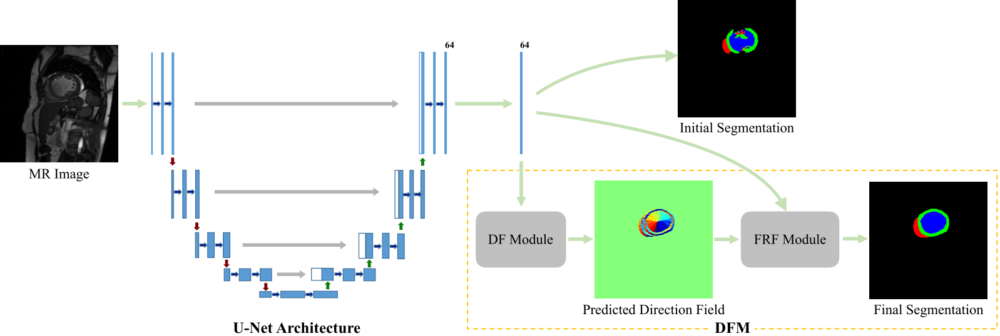

# DirectionalFeature

This repository contains the code of the following paper "**Learning Directional Feature Maps for Cardiac MRI Segmentation (published in MICCAI2020)**", https://arxiv.org/abs/2007.11349


## Citation

Please cite the related works in your publications if it helps your research:

```
@inproceedings{cheng2020learning,
  title={Learning directional feature maps for cardiac mri segmentation},
  author={Cheng, Feng and Chen, Cheng and Wang, Yukang and Shi, Heshui and Cao, Yukun and Tu, Dandan and Zhang, Changzheng and Xu, Yongchao},
  booktitle={International Conference on Medical Image Computing and Computer-Assisted Intervention},
  month = {Oct.},
  year={2020},
}
```
## Usage

### ACDC Data Preparation
1. Register and download ACDC-2017 dataset from https://www.creatis.insa-lyon.fr/Challenge/acdc/index.html
2. Create a folder outside the project with name **ACDC_DataSet** and copy the dataset.
3. From the project folder open file data_preprocess/acdc_data_preparation.py.
4. In the file, set the path to ACDC training dataset is pointed as: ```complete_data_path = '../../ACDC_DataSet/training' ```.
5. Run the script acdc_data_preparation.py.
6. The processed data for training is generated outside the project folder named *processed_acdc_dataset*.
